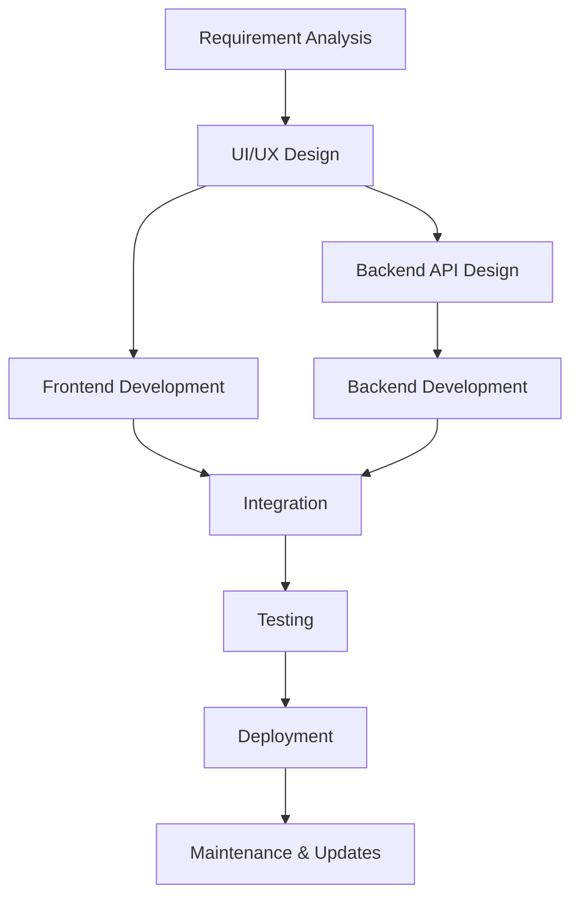

<div align="center">
  
# ✨ Jeeban Beura ✨


[](https://jee.vercel.app/)
[](https://linkedin.com/in/jeeban-beura)
[](https://instagram.com/decoding_life)


</div>

---

## 👨‍💻 About Me

```javascript
const jeeban = {
  location: "Bhubaneswar, Odisha",
  role: "Full Stack Developer",
  specialization: ["MERN Stack", "React Native", "Frontend Architecture"],
  currentFocus: "Building scalable mobile applications",
  hobbies: ["Coding", "Photography", "Exploring new tech"],
  education: "Computer Science Engineering"
};
```


---

<div align="center">
  
## 🛠️ Tech Stack

</div>

<table align="center">
  <tr>
    <td align="center" width="96">
      
      <br>React
    </td>
    <td align="center" width="96">
      
      <br>JavaScript
    </td>
    <td align="center" width="96">
      
      <br>Java
    </td>
    <td align="center" width="96">
      
      <br>Node.js
    </td>
    <td align="center" width="96">
      
      <br>REST API
    </td>
    <td align="center" width="96">
      
      <br>Redux
    </td>
  </tr>
  <tr>
    <td align="center" width="96">
      
      <br>MongoDB
    </td>
    <td align="center" width="96">
      
      <br>Express
    </td>
    <td align="center" width="96">
      
      <br>Tailwind
    </td>
    <td align="center" width="96">
      
      <br>Figma
    </td>
  </tr>
</table>

---

## 💻 Coding Environment & Tools

<div align="center">
  
  
  
  
  
  
  
  
  
  
</div>

<div align="center">
  
</div>

---

<div align="center">
  
## 📊 GitHub Stats

</div>

<div align="center">
  
  
</div>

<div align="center">
  
</div>

---

<div align="center">
  
## 👨‍💻 Coding Activity


</div>

---

<div align="center">
  
## 🏆 Featured Projects

</div>

<div align="center">
  <a href="https://github.com/JeebanBeura/Fylo-Data-Storage-Component">
    
  </a>
  <a href="https://github.com/JeebanBeura/Technical-Documentation-Page">
    
  </a>
</div>
<div align="center">
  <a href="https://github.com/JeebanBeura/Product-Landing-Page">
    
  </a>
  <a href="https://github.com/JeebanBeura/QR-code-component">
    
  </a>
</div>

---

<div align="center">
  
## 📝 Latest Blog Posts

• [Building Performant React Native Apps](https://jee.vercel.app/blog/performant-react-native)
• [MERN Stack Authentication Best Practices](https://jee.vercel.app/blog/mern-auth)
• [State Management in 2025](https://jee.vercel.app/blog/state-management)

</div>

---

<div align="center">
  
## 🚀 My Development Workflow



</div>

---

<div align="center">
  
## 📫 Contact Me

📧 **Email**: jb.jeebanbeura@gmail.com
📍 **Location**: Bhubaneswar, Odisha
📌 **Open for**: Freelance, Full-time opportunities


</div>

---

<div align="center">
  
### "Code is like humor. When you have to explain it, it's bad." – Cory House


</div>
